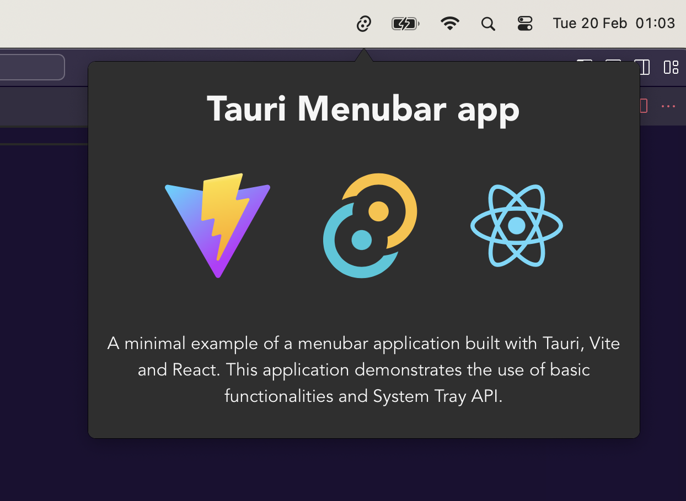

# Tauri Menubar

  

A minimal example of a menubar application built with [Tauri](https://tauri.app/). This application demonstrates the use of basic functionalities and System Tray API.

Based on the 4gray's Vite/Vue [repository](https://github.com/4gray/tauri-menubar-app). If you'd like to build it using Vue, check out his repo.
## Features

- Toggle window when clicking on an icon in menubar/tray
- Positioning the window centrally below the icon
- Hiding dock icon for macOS and windows
- Click outside to hide the application
- Right click context menu
- CSS based arrow between menubar and application

## Running the application
To run the application, you need to have Tauri installed on your machine. You can find the installation instructions on the Tauri website.

    $ pnpm install 
    $ pnpm tauri dev

## Recommended IDE Setup

- [VS Code](https://code.visualstudio.com/) + [Tauri](https://marketplace.visualstudio.com/items?itemName=tauri-apps.tauri-vscode) + [rust-analyzer](https://marketplace.visualstudio.com/items?itemName=rust-lang.rust-analyzer)

## Contribute
If you would like to contribute to this project, please fork the repository and open a pull request with your changes.

## License
This project is licensed under the MIT License - see the LICENSE file for details

## Acknowledgements
Tauri Team for providing the framework
